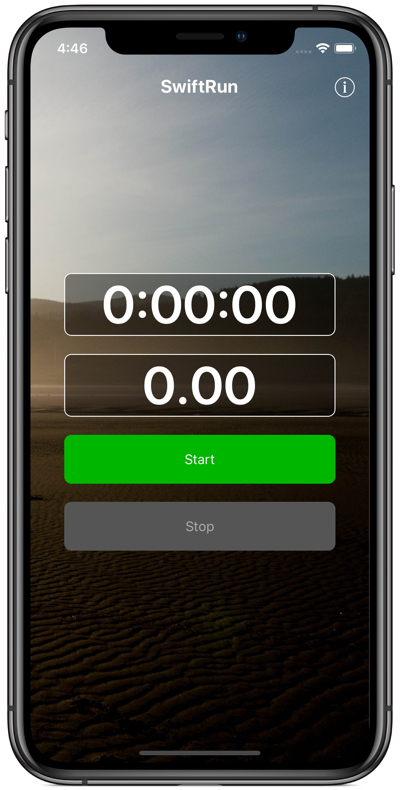

# SwiftRun
Example of a running app in Swift.

The purpose of this project is to explore and demonstrate some different areas of Swift and iOS development:
* UI Navigation with a Co-ordinator
* MVVM
* Dependency Injection
* Unit Testing `CLLocationManager` with a Mock

<p align="center">
  
</p>


## QuickStart
1. Clone this repository.
```
$ git clone https://github.com/harrisonrw/SwiftRun.git
```

2. Open the project in Xcode.
```
$ open SwiftRun.xcodeproj
```

3. Build and Run in the **iOS Simulator**.

## Requirements
- Xcode 10.2.1
- iOS 12.2+
- Swift 5
